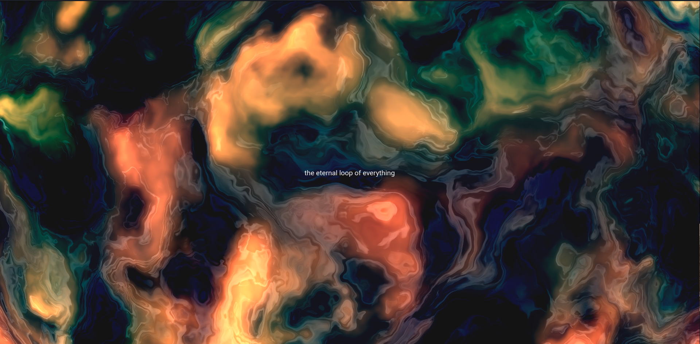
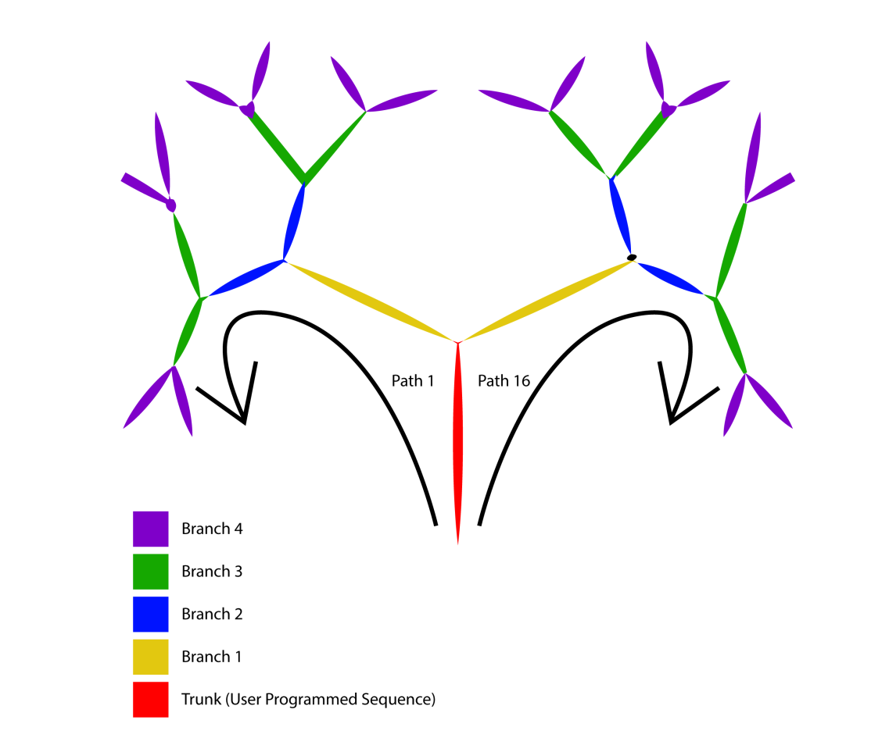
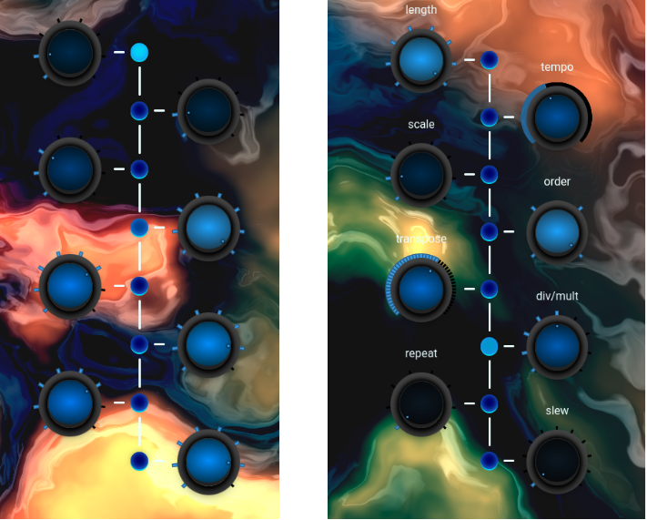

# Pulseq

Pulseq is a fractal sequencer implemented in [Svelte](https://svelte.dev/) as a single-page application (SPA) and 
inspired by Eurorack module [Bloom by Qu-Bit Electronix](https://www.qubitelectronix.com/shop/bloom). 
Demo available [here](https://mpetteno-polimi.github.io/ACTM-Pulseq).

## Concept

Pulseq uses a user-constructed sequence to recursively generate a tree of related subsequences that are strung together
to create large musical sequences that relate back to the originally programmed sequence.

First, the user programs the main sequence which from now on will be called **Trunk** (details for the control 
functions of the *Trunk* are described in the [Functions](#functions) section). The *branches* and *path* knobs can 
then be used to control the tree generation:

- **branches** - Sets the number of branches to follow the Trunk sequence. When all the way down, only the Trunk 
sequence will play. When all the way up, the Trunk, and 7 related subsequences of the same length will extend the 
sequence.

- **path** - Sets the direction followed by the fractal sequence. The number of paths is determined by the branch 
parameter (if $n$ is the number of branches the possible paths are $2^n$).

Below is a figure displaying how the path control works with *branches* set to 4 (16 possible paths). 

After the *Trunk* sequence has been played, the sequence will continue on the next tree's branch following the selected 
path. The subsequence that follows the trunk will be most closely related to the original sequence and the 
transformation will be in the form of one of the following modifications:
- **Transposition** - The previous sequence is transposed up or down by as much as one octave (twelve semitones).
- **Inversion** - The previous sequence is inverted so that the highest note in the sequence is now the lowest, and 
vice versa.
- **Reversal** - The previous sequence is reversed so that the first note in the sequence is now the last, and vice 
versa.
- **Mutation** - The previous sequence is mutated so that some notes are adjusted up or down as much as an octave.

<ins>Note that</ins>:
- The subsequence for the next branch will be related to the subsequence of the previous branch, not to the *Trunk* 
sequence (except the first branch obviously). This allows the musical evolution of a simple melody.
- Everytime the *Trunk* is adjusted or the number of branches is changed, the entire tree is regenerated.

## Functions

In order to program the *Trunk* sequence, two features have been implemented for each sequencer knob.

**Notes Mode**

This is the default mode for the sequencer. In this mode each knob can be used to tune the note for each step of the 
*Trunk* sequence. The possible notes for each step are set according to the selected scale starting from note A3.

**Controls Mode**

This mode is activated by holding down the Ctrl key. In this mode, each knob can be used to set a global parameter for 
the sequence. In detail, the available controls are:
- **Length** - Changes the length of the sequence from 1 to 8 steps.
- **Tempo** - Controls the BPM of the sequence.
- **Scale** - Set the sequence's scale. Available scales are:
  - Chromatic
  - Major
  - Minor
  - Major Pentatonic
  - Minor Pentatonic
  - Harmonic Minor
  - Whole Tone
  - Random (scale is chosen randomly from [this](https://github.com/tonaljs/tonal/tree/main/packages/scale#scalenames) list)
- **Order** - Controls the playback order of each step in the sequence. Available orders are:
  - Forward
  - Backward
  - Pendulum
  - Random
- **Transpose** - Sets the root offset of the entire sequence.
- **Div/Mult** - Sets the division/multiplication of each step in relation to the selected BPM.
- **Repeat** - During playback, each step will be repeated as many times as dictated by this parameter.
- **Slew** - Controls the glide time between notes.

## Sounds and Effects

Beside the knobs for controlling the *Trunk* sequence and the tree generation, the user has the possibility to play the 
sequences with eight different sounds (selectable through the **sounds** knob) and to apply three different pre-set 
effects: a reverb, a ping-pong delay and a distortion (in control mode there are three knobs that control the 
**dry/wet** mix for each effect).

## Shortcuts

Available shortcuts are:
- **Ctrl+M** - Mute/Unmute the sequencer
- ... more to be added

## Dependencies
- [Tone.js](https://tonejs.github.io) - Sounds and Effects
- [Tonal](https://github.com/tonaljs/tonal) - Music Theory
- [ThreeJS](https://github.com/mrdoob/three.js) - GLSL shader background
